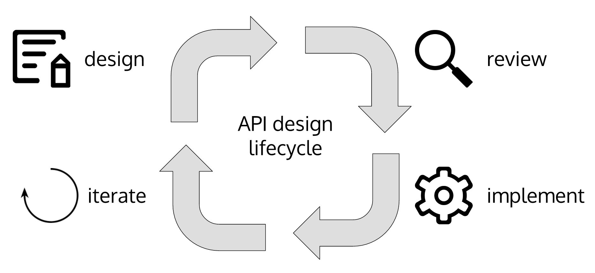

# goa で始めるデザイン・ファーストな API 開発

@Tamrin007 同志社大学大学院

#HSLIDE

## この LT の対象者

- WebAPI をよく書く <!-- .element: class="fragment" -->
- クライアントサイドとサーバサイドを分離して開発している <!-- .element: class="fragment" -->
- SPA の開発時、 API 開発を素早く行いたい <!-- .element: class="fragment" -->
- ネイティブアプリの開発時（ｒｙ <!-- .element: class="fragment" -->
- API ドキュメントを書くのが面倒 <!-- .element: class="fragment" -->
- Go が好きだ <!-- .element: class="fragment" -->

#HSLIDE

## モノリシックからマイクロサービスへ

#HSLIDE

## API 開発のライフサイクル

#HSLIDE

## Hello, goa

#HSLIDE

## goa とは

- マイクロサービス構築ためのフレームワーク
- API のデザインからモック・ドキュメントを自動生成
- API 開発者はビジネスロジックに集中できる
- クライアントサイド開発者は動くモックを素早く生成できる
- デザイン・ファースト

#HSLIDE

## Demo
